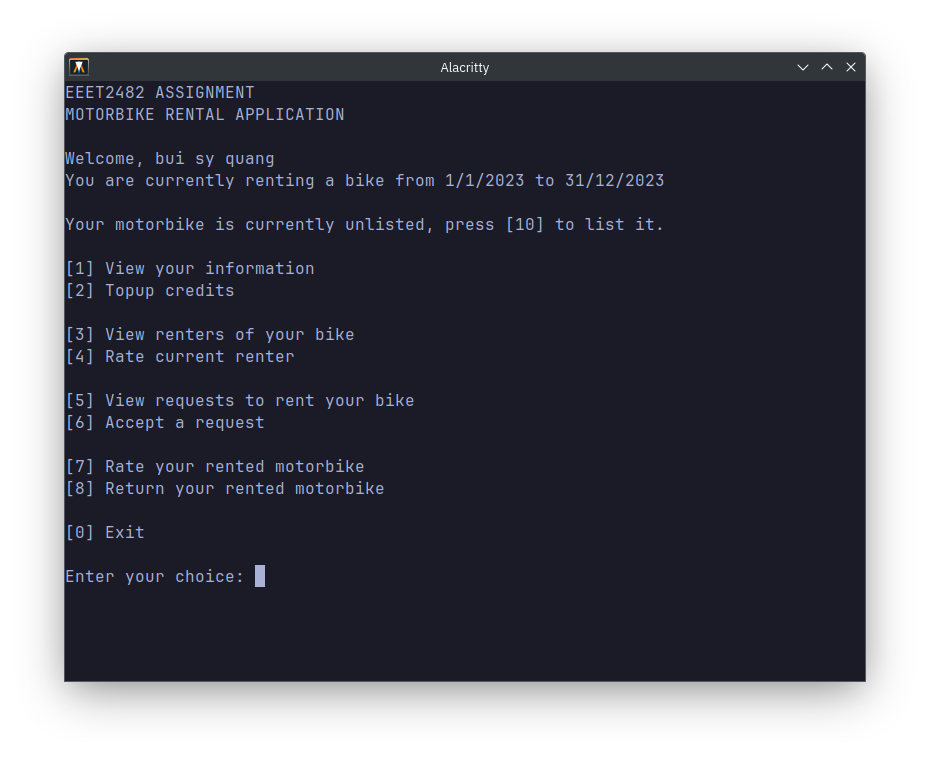

# SED Project - Motorbike Rental App


<p align="center">
    
</p>

## Getting started

Build the app on any platform using `g++` with the following command:
```bash
g++ src/**/*.cpp -o ./motorbike-rental
```
or if the above doesn't work:
```bash
g++ src/main.cpp src/**/*.cpp -o ./motorbike-rental
```

Another better choice, compile with [zig](https://ziglang.org/):
```bash
zig c++ src/**/*.cpp -o ./motorbike-rental
```
or:
```bash
zig c++ src/main.cpp src/**/*.cpp -o ./motorbike-rental
```

### Details
Using admin prompt, the default credentials are: `admin`/`admin`